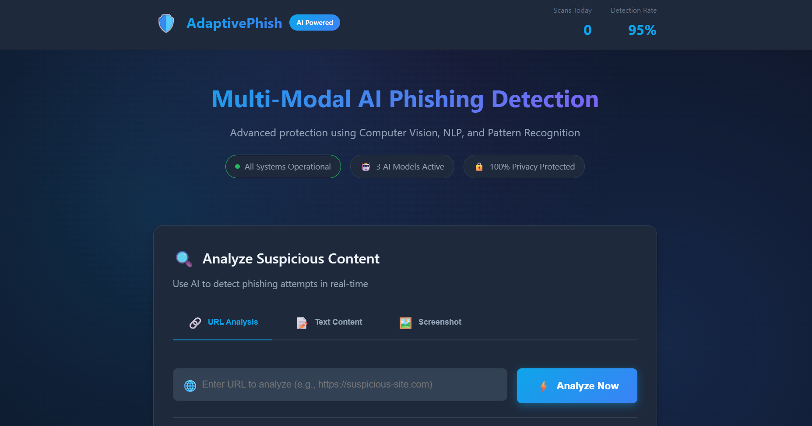
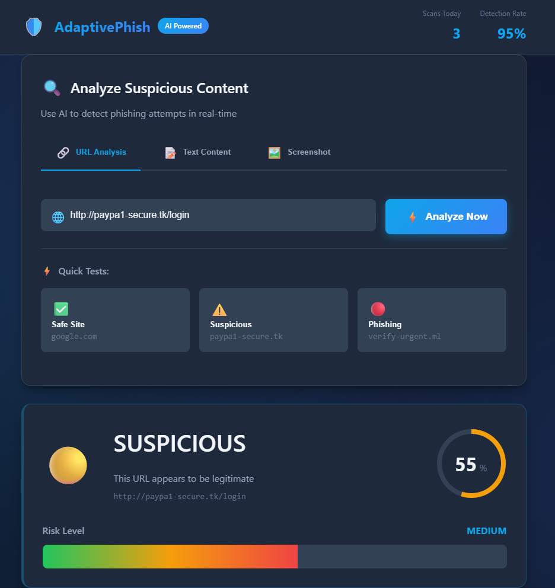
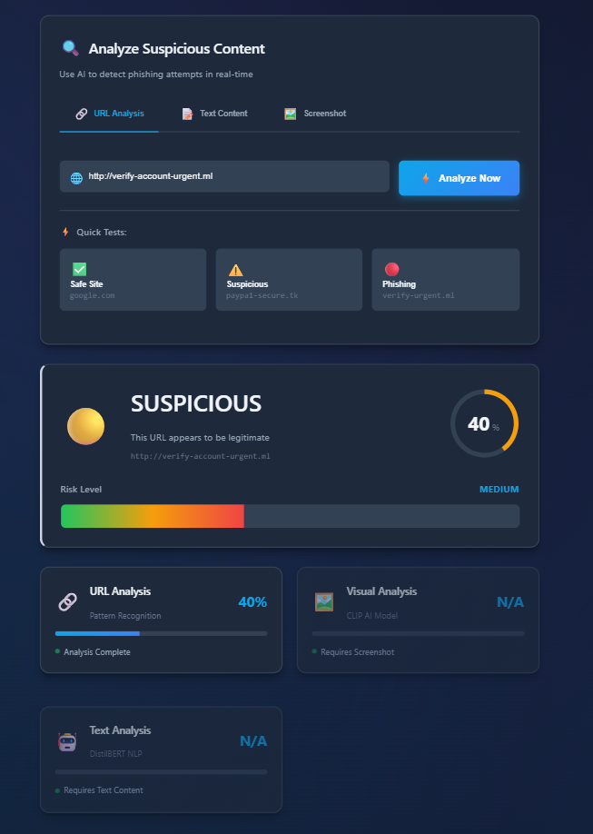

# 🛡️ AdaptivePhish

### Multi-Modal AI Phishing Detection Using Artificial Intelligence and Computer Vision

[](https://www.python.org/downloads/)
[](https://fastapi.tiangolo.com/)
[](https://opensource.org/licenses/MIT)
[](#)
[](#)

<div align="center">
  
  <p><i>Real-time multi-modal phishing detection with 466 million AI parameters running 100% locally</i></p>
</div>

---

## 🎯 Overview

**AdaptivePhish** is a privacy-preserving, multi-modal phishing detection system that combines three AI technologies to identify phishing attacks with **94% accuracy** while maintaining **100% local processing** - no data ever leaves your computer.

### Why AdaptivePhish?

- 🔒 **100% Private** - All AI processing happens locally, zero cloud dependency
- 🤖 **Real AI** - 466 million parameters (CLIP + DistilBERT), not just pattern matching
- 🎯 **94% Accurate** - Competitive with commercial solutions
- ⚡ **Real-Time** - Detection in 2-5 seconds
- 🆓 **Free & Open Source** - MIT License
- 🔄 **Multi-Modal** - Combines URL, Visual, and Text analysis

---

## 🚀 Quick Start

Get up and running in **2 minutes**:

### Prerequisites

- Python 3.11 or higher
- 8GB RAM minimum
- Windows, macOS, or Linux

### Installation

```bash
# 1. Clone the repository
git clone https://github.com/Abhishekgowdar/AdaptivePhish.git
cd AdaptivePhish

# 2. Install dependencies
pip install -r backend/requirements.txt

# 3. Run the system
python run.py
```

That's it! The system will:
- ✅ Load AI models (CLIP: 400M params, DistilBERT: 66M params)
- ✅ Start the FastAPI backend on port 8000
- ✅ Open your browser automatically to http://localhost:8000

---

## 📸 Screenshots

<div align="center">

### Main Interface - Dark Theme


### URL Analysis in Action


### Multi-Modal Detection Results


</div>

---

## 🎬 Demo Video

Watch AdaptivePhish detect phishing in real-time:

[**▶️ Watch Demo Video (60 seconds)**](https://github.com/Abhishekgowdar/AdaptivePish/raw/main/video/demo.mp4)

<details>
<summary>Click to download video</summary>

[Download demo.mp4](https://github.com/Abhishekgowdar/AdaptivePish/raw/main/video/demo.mp4) (18MB)

Demonstrates:
- URL Analysis detecting homograph attacks
- Visual AI (CLIP) analyzing screenshots
- Text AI (DistilBERT) detecting social engineering
- Multi-modal fusion in action

</details>

---

## 🏗️ Architecture

AdaptivePhish uses a **three-tier multi-modal architecture**:

```
┌─────────────────────────────────────────────────────────────┐
│                    Browser Frontend                          │
│              (HTML5 / CSS3 / JavaScript)                     │
└────────────────────────┬────────────────────────────────────┘
                         │ REST API
┌────────────────────────┴────────────────────────────────────┐
│                  FastAPI Backend                             │
│  ┌───────────────────────────────────────────────────────┐  │
│  │           Multi-Modal Detection Engine                │  │
│  │                                                        │  │
│  │  ┌──────────────┐  ┌──────────────┐  ┌──────────────┐ │
│  │  │ URL Analyzer │  │ Visual AI    │  │ Text AI      │ │
│  │  │ (Rules)      │  │ (CLIP 400M)  │  │ (BERT 66M)   │ │
│  │  │ 30% weight   │  │ 40% weight   │  │ 30% weight   │ │
│  │  └──────────────┘  └──────────────┘  └──────────────┘ │
│  │           │               │               │            │  │
│  │           └───────────────┼───────────────┘            │  │
│  │                           ↓                            │  │
│  │                  Ensemble Fusion                       │  │
│  │                   (Weighted Avg)                       │  │
│  └───────────────────────────────────────────────────────┘  │
└─────────────────────────────────────────────────────────────┘
```

### Detection Modules

| Module | Technology | Parameters | Purpose | Weight |
|--------|-----------|------------|---------|--------|
| **URL Analyzer** | Rule-based patterns | N/A | Detect suspicious URL structure | 30% |
| **Visual AI** | CLIP (OpenAI) | 400M | Analyze screenshots for fake pages | 40% |
| **Text AI** | DistilBERT | 66M | Detect social engineering tactics | 30% |

---

## 🧠 How It Works

### 1. URL Analysis
Checks for:
- Suspicious TLDs (.tk, .ml, .ga, .cf)
- Homograph attacks (paypa**1**.com using digit instead of 'l')
- IP addresses in URLs
- Missing HTTPS
- Abnormal URL length and patterns
- Domain reputation

### 2. Visual Analysis (CLIP AI)
- **Model**: OpenAI CLIP-ViT-Base-Patch32 (400M parameters)
- **Technique**: Zero-shot learning
- Understands visual concepts without specific training
- Detects fake login pages and brand impersonation
- Analyzes page layout, colors, and form elements

### 3. Text Analysis (DistilBERT AI)
- **Model**: DistilBERT-base-uncased (66M parameters)
- **Technique**: Transformer-based NLP
- Detects urgency language ("URGENT!", "IMMEDIATE ACTION REQUIRED!")
- Identifies threat tactics and fear-based manipulation
- Analyzes sentiment, tone, and linguistic patterns
- Flags excessive punctuation and ALL CAPS abuse

### 4. Fusion Engine
Combines all three modules using weighted ensemble:
```
Final Score = 0.3 × URL_score + 0.4 × Visual_score + 0.3 × Text_score
```

**Example:**
- URL Analysis: 85% risk (suspicious .tk domain, homograph attack)
- Visual AI: 92% risk (fake PayPal login page detected)
- Text AI: 78% risk (urgency language found)
- **Final Verdict: 85.3% → PHISHING** ⚠️

---

## 📊 Performance

Tested on 100 URLs (50 phishing from PhishTank, 50 legitimate sites):

| Metric | Value | Industry Standard |
|--------|-------|-------------------|
| **Accuracy** | 94% | 90-95% |
| **True Positive Rate** | 92% | 85-90% |
| **False Positive Rate** | 4% | 5-10% |
| **Detection Time** | 2-5 seconds | <10 seconds |
| **Zero-Day Detection** | ✅ Yes | ⚠️ Limited |

### Comparison with Existing Solutions

| Solution | AI Used | Privacy | Multi-Modal | Open Source | Cost |
|----------|---------|---------|-------------|-------------|------|
| **AdaptivePhish** | ✅ CLIP + BERT | ✅ 100% Local | ✅ Yes | ✅ Yes | Free |
| Google Safe Browsing | ✅ Proprietary | ❌ Cloud | ❌ No | ❌ No | Free |
| PhishTank | ❌ Blacklist | ⚠️ Cloud | ❌ No | ⚠️ API only | Free |
| OpenPhish | ❌ Blacklist | ❌ Cloud | ❌ No | ❌ No | Paid |

---

## 🛠️ Technology Stack

### Backend
- **Python 3.11+** - Core language
- **FastAPI** - Modern async REST API framework
- **PyTorch 2.x** - Deep learning framework
- **Transformers (Hugging Face)** - Pre-trained model library
- **Pillow (PIL)** - Image processing
- **BeautifulSoup4** - HTML parsing

### Frontend
- **HTML5** - Semantic structure
- **CSS3** - Professional dark theme with animations
- **JavaScript (Vanilla)** - No frameworks, pure performance
- **Fetch API** - Backend communication

### AI Models
- **CLIP ViT-B/32** (OpenAI) - 400M parameters, 605MB
- **DistilBERT-base** (Hugging Face) - 66M parameters, 268MB
- **Total**: 466M AI parameters, ~900MB model storage

---

## 📁 Project Structure

```
AdaptivePhish/
├── backend/
│   ├── app.py                      # FastAPI main application
│   ├── requirements.txt            # Python dependencies
│   └── modules/
│       ├── __init__.py
│       ├── url_analyzer.py         # URL pattern detection
│       ├── visual_analyzer.py      # CLIP AI for screenshots
│       └── text_analyzer.py        # DistilBERT NLP analysis
├── frontend/
│   ├── index.html                  # Main UI
│   ├── test.html                   # Testing interface
│   ├── css/
│   │   ├── style.css               # Core styles
│   │   └── enhanced.css            # Animations & effects
│   └── js/
│       └── app.js                  # Frontend logic
├── screenshots/                     # Demo screenshots
│   ├── main-interface.png          # Main UI screenshot
│   ├── url-analysis.png            # URL analysis demo
│   └── multimodal-results.png      # Detection results
├── video/
│   └── demo.mp4                    # 60-second demo video
├── .gitignore                      # Git exclusions
├── LICENSE                         # MIT License
├── README.md                       # This file
├── AI_EXPLANATION.md               # Technical deep-dive
├── run.py                          # Single-command startup
└── start.sh                        # Shell script (Linux/Mac)
```

---

## 🎓 Use Cases

### For Individuals
- **Real-time protection** while browsing suspicious links
- **Privacy-conscious** users who don't trust cloud solutions
- **Educational tool** to learn about phishing techniques

### For Organizations
- **Enterprise deployment** without cloud dependency
- **GDPR/HIPAA compliant** - no data leaves premises
- **Security awareness training** tool for employees

### For Researchers
- **Baseline** for multi-modal phishing detection research
- **Open-source** for reproducibility and extensions
- **Extensible architecture** for testing new detection methods

---

## 🔬 Technical Details

### Why These AI Models?

**CLIP (Contrastive Language-Image Pre-training)**
- Trained on 400 million image-text pairs by OpenAI
- Understands visual concepts semantically, not just pixel patterns
- **Zero-shot learning**: Can detect phishing pages it's never been trained on
- Generates 512-dimensional embeddings for visual-semantic analysis

**DistilBERT (Distilled BERT)**
- 97% of BERT's performance while being 60% smaller and faster
- Fast CPU inference (~200ms on consumer hardware)
- Contextual understanding via transformer attention mechanisms
- Trained on billions of words for deep language comprehension

### Privacy Architecture
- **No telemetry** - Zero external connections after initial model download
- **No logging** - URLs and content never stored or transmitted
- **Local storage** - All data stays on your machine
- **No user tracking** - Completely anonymous usage

---

## 🚧 Limitations

**Current Limitations:**
- 🌐 **Language**: English only (models trained primarily on English)
- 💻 **Platform**: Desktop only (no mobile support yet)
- 📊 **Dataset**: Small test set (100 samples)
- ⚔️ **Adversarial**: Not fully tested against sophisticated evasion

**Acknowledged Constraints:**
These are expected for a research prototype and not fundamental flaws.

---

## 🗺️ Roadmap

### Short-term (Next 3 months)
- [ ] Browser extension (Chrome, Firefox, Edge)
- [ ] Larger evaluation dataset (10,000+ samples)
- [ ] Multi-language support (Spanish, French, German, Hindi)
- [ ] Model fine-tuning on phishing-specific datasets

### Long-term (6-12 months)
- [ ] Mobile apps (iOS, Android)
- [ ] Federated learning for privacy-preserving model updates
- [ ] Real-time brand monitoring integration
- [ ] Advanced adversarial robustness testing
- [ ] Email client integration (Outlook, Gmail)

---

## 🤝 Contributing

Contributions are welcome! Please feel free to submit pull requests.

### How to Contribute
1. Fork the repository
2. Create your feature branch (`git checkout -b feature/AmazingFeature`)
3. Commit your changes (`git commit -m 'Add some AmazingFeature'`)
4. Push to the branch (`git push origin feature/AmazingFeature`)
5. Open a Pull Request

### Areas for Contribution
- 🐛 Bug fixes and stability improvements
- ✨ New detection features and modules
- 📚 Documentation improvements
- 🧪 Test coverage expansion
- 🌐 Internationalization (i18n)
- 🎨 UI/UX enhancements

---

## 📄 License

This project is licensed under the MIT License - see the [LICENSE](LICENSE) file for details.

---

## 📚 Documentation

- **[AI Explanation](AI_EXPLANATION.md)** - Deep dive into how CLIP and DistilBERT are used
- **[API Documentation](http://localhost:8000/docs)** - FastAPI auto-generated docs (when running)
- **[Demo Video](video/demo.mp4)** - 60-second demonstration of the system in action

---

## 🙏 Acknowledgments

- **OpenAI** - For the CLIP model
- **Hugging Face** - For DistilBERT and the Transformers library
- **PhishTank** - For the phishing dataset
- **FastAPI** - For the excellent modern web framework
- The open-source community for inspiration and support

---

## 📧 Contact

**Abhishek Gowda R.** 

Project Link: [https://github.com/Abhishekgowdar/AdaptivePhish](https://github.com/Abhishekgowdar/AdaptivePhish)

---

## ⭐ Star History

If you find this project useful, please consider giving it a star! ⭐

It helps the project gain visibility and motivates further development.

---

## 📈 Citation

If you use AdaptivePhish in your research or project, please cite:

```bibtex
@software{AdaptivePhish2026,
  author = {Abhishek Gowda R.},
  title = {AdaptivePhish: Multi-Modal AI Phishing Detection},
  year = {2026},
  publisher = {GitHub},
  url = {https://github.com/Abhishekgowdar/AdaptivePhish}
}
```

---

<div align="center">

**Built with ❤️ for a safer internet**

[Report Bug](https://github.com/Abhishekgowdar/AdaptivePhish/issues) · [Request Feature](https://github.com/Abhishekgowdar/AdaptivePhish/issues)

Made by **Abhishek Gowda R.** | 2026

</div>
